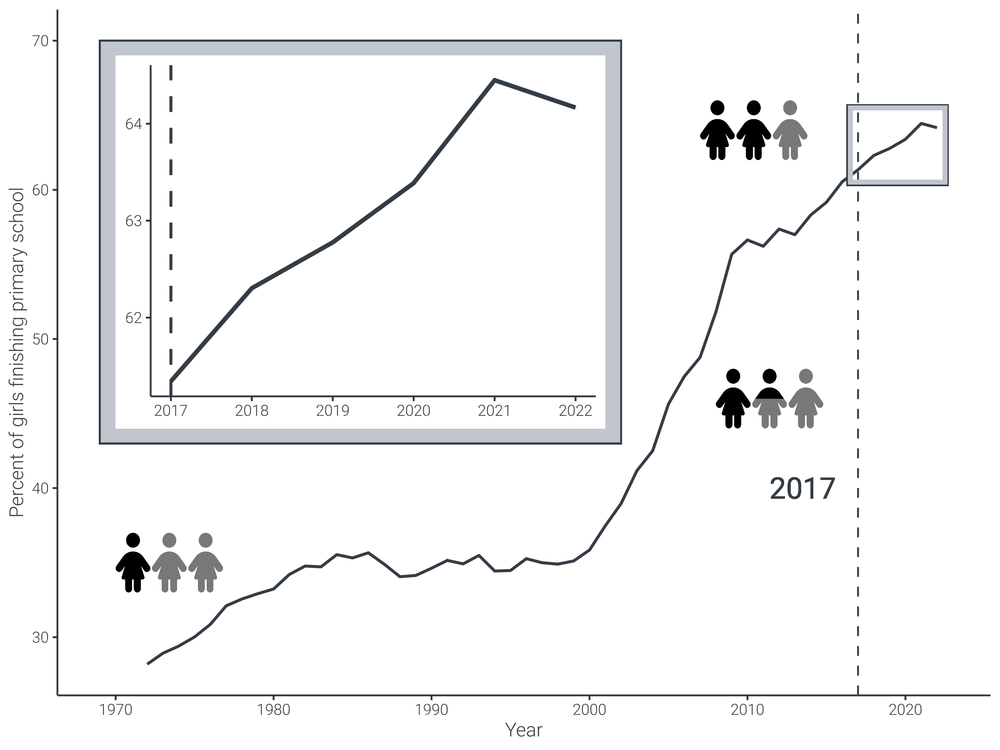
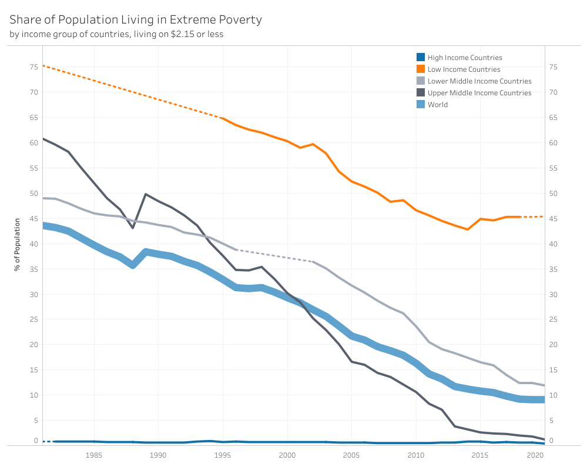
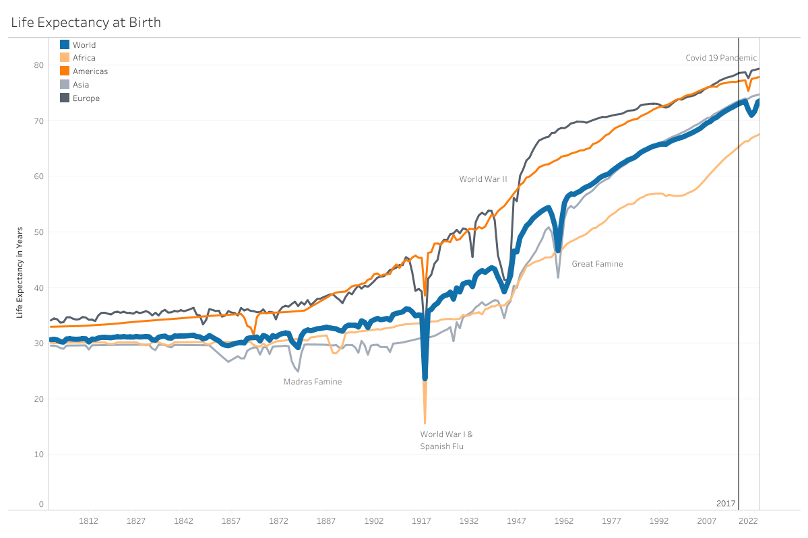
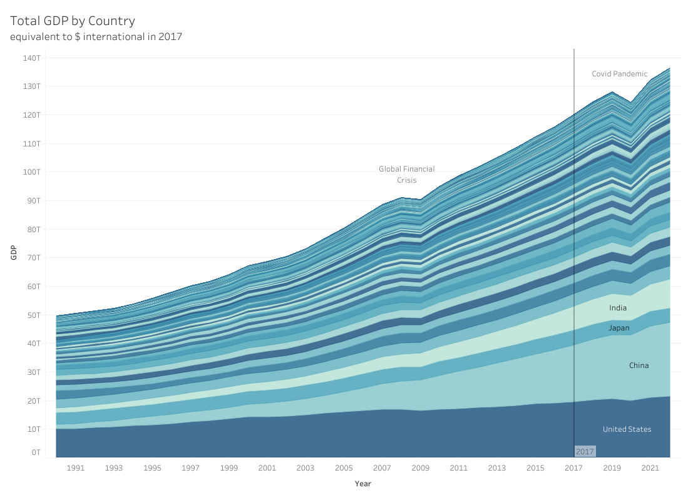
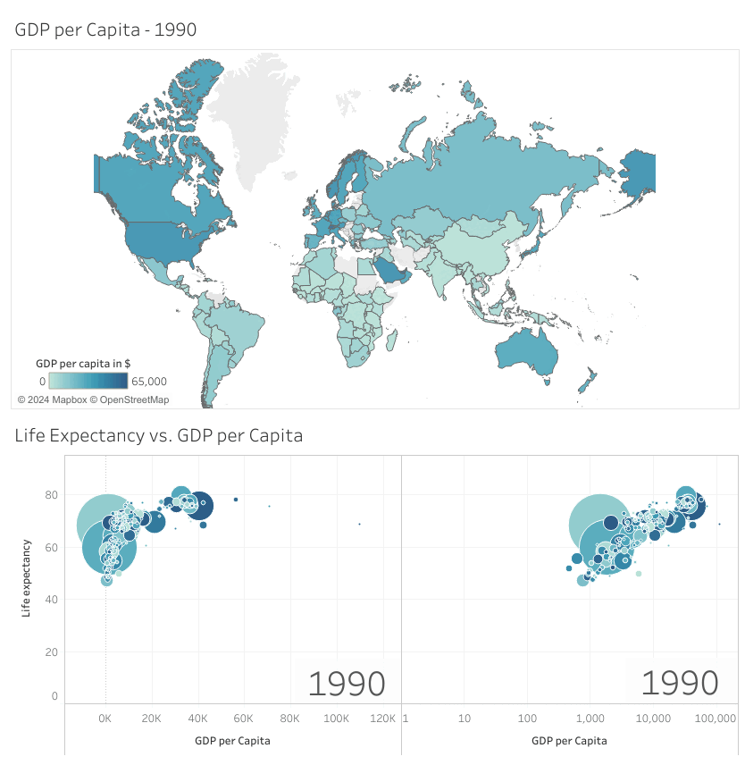
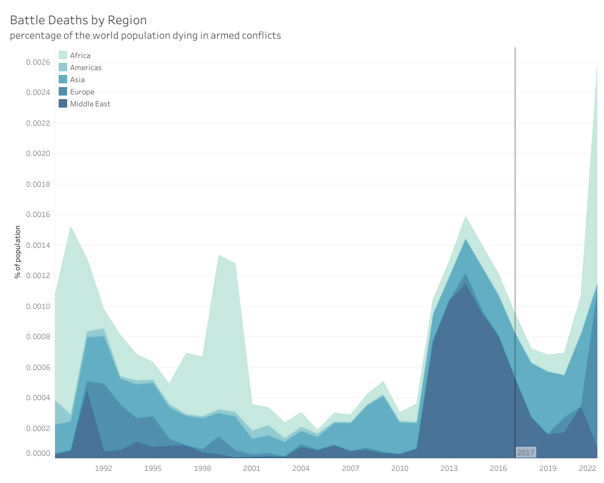

# An Update on Factfulness in 2024

I recently began reading "Factfulness", written by Hans Rosling, along with his son Ola Rosling and daughter-in-law Anna Rosling Rönnlund. For those unfamiliar, the book sheds light on how we often perceive the world as being more negative and hostile than it truly is. We tend to exaggerate the prevalence of child mortality due to hunger, ongoing wars, and fatalities from natural disasters, while overlooking the positive developments occurring globally. When questioned about the number of people being lifted out of poverty or the improvement in access to basic healthcare, the majority of responses are more pessimistic than if answers were chosen at random. Essentially, we humans are inclined towards a negativity bias regarding the state of the world.

Using data, numbers, and graphs, "Factfulness" aims to correct our misconceptions and demonstrate how our naive views of the world are often mistaken. However, the data presented in the book dates back to 2017, and a lot has changed since then. Especially with the recent coronavirus pandemic, it feels like the world is regressing to darker times. 
Those of you who are familiar with "Factfulness" probably know not to take these intuitive feelings as the ultimate truth. Therefore I set out to investigate the data in 2024 to see what has really happened since 2017.

## Child Mortality and Birth Rates 

The first graph we come across in the book shows with how many children are born per woman. This is compared to the number of children surviving to the age of five. Each blob represents a country. 

[Data: United Nations, Department of Economic and Social Affairs, Population Division (2022). World Population Prospects 2022, Online Edition]

Here, we can see the trend from before 2017 continuing until 2021 (when the most recent data was collected).
So in this case it seems like our gut feeling led us astray. There is no sudden drop in the survival rate or increase in children born. But child survival rates might just be something changing slower and the recent developments might just not show their impact quite yet. So let's go on and explore further.  
(In case you are wondering what the big blob is doing at around 1960 - that's China during the great famine.) 

## Girls in Primary School 

Next, let's take a look at the number of girls finishing primary school in low-income countries. 

[Data: FREE DATA FROM WORLD BANK VIA GAPMINDER.ORG]
While during the seventies only one in three girls finished primary school, today the number has doubled to two in three. However, the rate of increase has dropped with the 10er years. But even after 2017, the number is still rising. Only the last bump from 2021 to 2022 seems a little worrying. However, it is too early to tell if this is just a little dip or the start of a downward trend.  

## Poverty 

Now let's move on to poverty. When we look at the percentage of people living in poverty, we can clearly see it decreasing more slowly. Rather the graphs are mostly flatlining, especially in the poorest countries. That being said, we are still doing a good deal better than we have done for most of human history.

[Data: World Bank, World Development Indicators, Headcount ratio at $2.15 per day (2017 PPP)]

## Life Expectancy 

When we look at the life expectancy over time we can see a steady increase. The Covid pandemic does create a small dent in the graph, but it appears like we are already back on track with the same progress as we were before. The graphs are also slowly plateauing, this is most likely due to natural limits on un-enhanced human life spans rather than a  stop in progress. It is interesting when we compare the time before 1970 and after, we can see that we have been living in remarkably stable times for the last half-century.   

[Data: Gapminder, Life Expectancy at Birth v12]

## GDP

Next, let's take a look at the GDP per capita - this is pretty straightforward - it definitely took a dip during the Covid pandemic, but afterward, it got right back on track. 

[Data: World Bank GDP, PPP (constant 2017 international $)]

With the animation, we can see the dip during the Covid pandemic as well. It shows as a little hick-up in the year 2020. In the lower-right section, I have plotted the GDP vs the life expectancy as is shown in the book - It seems like the whole world is pretty much unified and there is no major difference between the countries. In my opinion, the graphic is misleading though, as it has the GDP on a logarithmic scale. I tried to plot the GDP on a linear scale instead and - lo and behold - there is a division between more and less wealthy countries! Still, the less wealthy countries are catching up, logarithmic or linear. 

[Data: World Bank GDP per Capita, PPP (constant 2017 international $)]

## Battle Deaths

The last topic from factfulness I want to visit is the casualties from war. Here, things do not look too good in recent years. Deaths from armed conflicts have been going up sharply recently. We can just hope that this is a historical hick-up, rather than a trend that will continue.    

[Data: Davies, Shawn, Therese Pettersson & Magnus Öberg (2023). Organized violence 1989-2022 and the return of conflicts between states?. Journal of Peace Research 60(4).]

