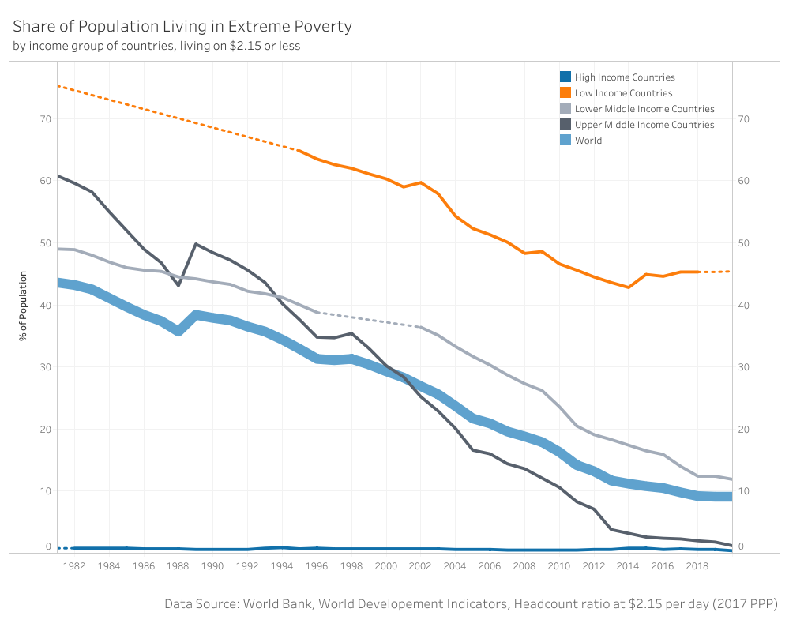

# An Update on Factfulness in 2024

I recently began reading "Factfulness", written by Hans Rosling, along with his son Ola Rosling and daughter-in-law Anna Rosling Rönnlund. For those unfamiliar, the book sheds light on how we often perceive the world as being more negative and hostile than it truly is. We tend to exaggerate the prevalence of child mortality due to hunger, ongoing wars, and fatalities from natural disasters, while overlooking the positive developments occurring globally. When questioned about the number of people being lifted out of poverty or the improvement in access to basic healthcare, the majority of responses are more pessimistic than if answers were chosen at random. Essentially, we humans are inclined towards a negativity bias regarding the state of the world.

Using data, numbers, and graphs, "Factfulness" aims to correct our misconceptions and demonstrate how our naive views of the world are often mistaken. However, the data presented in the book dates back to 2017, and a lot has changed since then. Especially with the recent coronavirus pandemic, it feels like the world is regressing to darker times. 
Those of you who are familiar with "Factfulness" probably know not to take these intuitive feelings as the ultimate truth. Therefore I set out to investigate the data in 2024 to see what has really happened since 2017.

## Child Mortality and Birth Rates 

The first graph we come across in the book shows with how many children are born per woman. This is compared to the number of children surviving to the age of five. Each blob represents a country. 

[Source: United Nations, Department of Economic and Social Affairs, Population Division (2022). World Population Prospects 2022, Online Edition]

Here we can clearly see the trend from before 2017 continuing until 2021 (when the most recent data was collected).
So in this case it seems like our gut feeling led us astray. There is no sudden drop of the survival rate or increase in children born. But child survival rates might just be something changing slower and the recent developements might just not show their impact quite yet. So lets go on and explore further.  
(In case you are wondering what the big blob is doing at around 1960 - thats China during the great famine.) 

## Girls in Primary School 

Next lets look at the number of girls finishing primary school in low income countries. 

[Source: FREE DATA FROM WORLD BANK VIA GAPMINDER.ORG]
While in the seventies only one in three girls finished primary school, today the number has doubled to two in three. However the rate of increase has dropped with the 10er years. But even after 2017, the number is still rising. Only the last bump from 2021 to 2022 seems a little worrying. However it is to early to tell if this is just a little dip or the start of a downward trend.  

## Poverty 

Moving on to poverty. what percentage of people used to live in poverty. In factfulness: $1.95, but with 2011 money and here $2.15 with 2017 money. 

## Live Expectancy 

drop with the covid pandemic afterwards back to prior level

## GDP

definetly a dip during the covid pandemic, but afterwards right back on track

